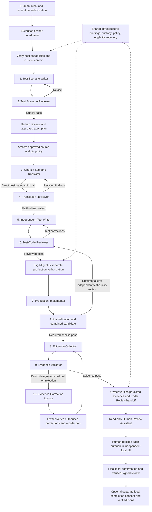

# Verified workflow: executive summary and delivery roadmap

**Status date:** 2026-10-06

**Publication branch:** `feature/verified-workflow`

**Audience:** Project owners, engineering leads, implementers, and human reviewers.

## Executive summary

The planned workflow separates intent, authoring, independent quality review,
production implementation, evidence validation, and human acceptance. An
execution Owner coordinates ten narrowly scoped specialists; it does not write
production code or replace their judgments. Shared infrastructure enforces
exact-context bindings, policy, storage, and transition rules.

The intended outcome is a traceable path from human-approved scenarios to
reviewed tests, validated behavior, durable criterion evidence, and independently
authorized human review. A passing report alone never grants permission to
implement, mutate a task, or mark it complete.

**Six foundation increments are implemented and published.** Their focused
runtime suites total **472 passing tests**. The next increment has independently
reviewed tests but no production implementation. The complete ten-specialist
workflow has not yet run end to end and is not deployment-ready.

The remaining work is primarily integration: managed host authority,
approval-bound planning history, scenario/translation contracts, eligibility
and refinement controls, recovery, MCP surfaces, persistent specialists, owner
integration, calibration, and a verified vertical slice before broad rollout.

No credible completion percentage is assigned. Completed foundations and
remaining integration increments differ materially in size and risk.

## Planned workflow

The diagram describes the **target**, not an observed production run.
Numbered specialist labels identify the ten roles. Owner, infrastructure,
human user, and the human-review helper are outside that count.



Arrows represent coordinated handoffs unless explicitly labeled as direct
designated child calls. The Advisor never invokes the Collector itself.
Scenario or translation approval does not authorize production. A legitimate
Red test result may support implementation eligibility, but cannot satisfy
whole-task Green or evidence-readiness gates.

The diagram simplifies failure routing: if independent review finds faulty
tests, Test Writer corrects them; if tests are valid, Production Implementer
diagnoses and repairs behavior only within separately authorized scope.
Blockers, unresolved human questions, drift, and exhausted refinement limits
pause dependent transitions rather than being overridden.

## Planned features and responsibility boundaries

| Feature | Intended capability |
| --- | --- |
| Human-owned intent | Only the human answers intent questions, changes scope/policy, and supplies required authorization. Questions-only responses do not fabricate candidates or reviews. |
| Native planning and approval | Establish supported host mode control, review the exact complete plan, and preserve approval-bound source/policy references. Mode selection is not plan acceptance. |
| Independent authoring and review | Separate scenario writing, fidelity review, executable test writing, test-quality review, and production implementation. No self-grading or silent TDD-agent substitution. |
| Exact context and identity | Bind artifacts and operations to project, task incarnation, criterion/source revisions, policy digest, and attempt; reject stale or foreign references. |
| Guarded editing and custody | Scope code work with leases and source checks; retain exact artifact bytes and immutable revision relationships with explicit uncertainty. These cooperative guards are not an OS sandbox. |
| Configurable quality policy | Validate per-stage thresholds and refinement limits. Mechanical score calculation is separate from semantic judgment and execution eligibility. |
| Dependencies and shared work | Account for shared fixtures/artifacts, split/merge lineage, independent authorized work, and combined-candidate interference without silently resetting limits. |
| Evidence integrity | Collect existing results without rerunning them, independently validate exact-revision evidence, route corrections, and verify persisted criterion evidence before review submission. |
| Recovery and truthful observations | Capture real parent/child results, cancellation, late results, stopped-work evidence, drift, and resume conditions; never manufacture host events. |
| Independent human acceptance | Local companion UI owns individual criterion decisions, final signed review confirmation, and separate completion consent. Chat remains guidance/readback, not an approval fallback. |

The source plan's original whole-task cap language was subsequently superseded
for this implementation: the user removed the total specialist-invocation cap
and Production Implementer-attempt cap. Do not restore them or invent
replacement values. The four project-policy per-criterion refinement limits
remain applicable and distinct.

## What is implemented today

### Completed foundations

| Increment | Implemented feature | Passing focused tests | Scope limit |
| --- | --- | ---: | --- |
| 1. Scoped editing | Typed leases, exact file scopes, source identity checks, guarded replacements, ownership-aware cleanup, explicit uncertainty | 46 | Retains `STATE_BUSY`; callers inspect `sourceMayHaveChanged`. No production MCP mutation endpoint. |
| 2. Bindings and policy | Versioned bindings, strict four-profile policy parser, read-only bounded exact-byte policy loader | 146 | No silent fallback and no live initializer or approval-bound task-policy snapshot yet. |
| 3. Reports and verdicts | Canonical rubrics, strict stage reports, deterministic arithmetic, blocker/mandatory-finding handling | 73 | Report validity does not authenticate evidence or establish semantic correctness. |
| 4. Workflow history | Bounded embedded-byte ledger, full revision digest chain, no-overwrite initialization, locking, idempotency, independent readback | 79 | Unsigned history is not proof against privileged rewriting and rehashing. |
| 5. Workflow identities | Separate registry, explicit project/task registration, exact canonical lookup, incarnation and current source checks | 75 | Identical-ID/creation-time recreation needs a future birth-event journal to be detectable. No live registry initialized. |
| 6. Task-bound custody | Fixed task-specific storage, fresh context checks, in-progress-only writes, required trusted authority, immutable operation and byte copies | 53 | Missing authority blocks writes. Existing authority fixtures are synthetic, not observed human approval. |
| **Total** | **Six completed library increments** | **472** | **Not an installed or end-to-end certification.** |

Detailed guides: [scoped edits](scoped-edits.md),
[policy](workflow-policy.md), [reports](workflow-reports.md),
[history](workflow-history.md), [identities](workflow-identities.md), and
[task-bound custody](task-workflow-history.md).

### Feasibility evidence, not shipped orchestration

Isolated bootstrap runs observed the designated Translator-to-Reviewer and
Validator-to-Advisor nesting, independent source reads, and actual parent/child
results. Native Plan-mode use was also observed in isolated checks.

The installed ACP server's actual notifications established same-session
Agent-to-Plan-to-Agent mode control and acknowledged session closure. That
session-control probe sent no model prompts or permission grants. It does not
establish plan approval, installed VS Code execution authority, or cancellation
during active model work.

A finite model wall-clock execution timeout remains unverified. Supervised
checks were authorized without claiming one. Bootstrap profiles and protocol
fixtures are not installed production specialists or real human consent.

### Current paused increment

Increment 7 has three authored test suites and a spawned synthetic ACP fixture,
with a final source-bound independent `READY_FOR_IMPLEMENTATION` verdict.
Corrections cover exact artifact-byte round trips, one-shot consumption,
no refund after a downstream failure, operation matching, drift/revocation,
and mutable-caller isolation.

The production ACP client, execution bridge, command manager, and real VS Code
modal adapter are absent. Production implementation remains **paused and
separately unapproved**.

Fresh publication checks recorded:

- Zero-warning lint passed for all changed TypeScript files.
- All 472 foundation tests passed.
- Whole-project TypeScript compilation failed with exactly six `TS2307`
  missing-module diagnostics: the intentionally published test-first state.
- Zero new authority runtime cases executed.

The foundations were published in commit `9c09041`; the explicitly labeled
Red tests were published in `341d95e`. The branch must not be described as
build-passing or ready to install.

## Effort estimates: assumptions and interpretation

The following estimates use the user's selected measure: **active effort
hours**, including implementation, tests, independent review, and expected
corrections. They exclude approval queues, authentication waits, download time,
installation/reload waits, and coordination delays.

- **GPT-6.1 Sol scenario:** supervised, tool-enabled development in the existing
  repository with scoped roles and the same quality gates. Hours represent
  active workflow execution and supervision, not pure inference/GPU time.
- **Human scenario:** one senior TypeScript/Node/VS Code engineer familiar with
  the repository, with access to separate review assistance. Hours are total
  engineering/review effort, not team calendar duration.
- Both assume existing dependencies and fixtures can be reused, authorized
  host access is available when needed, and no major architecture restart.
- These are **judgment-based planning ranges**, not measured historical effort,
  model throughput benchmarks, vendor performance claims, or guaranteed speedups.
  There is no verified GPT-6.1 Sol benchmark for this repository.
- Completed-increment estimates are **counterfactual reproduction estimates**
  at comparable scope and quality, not the duration actually spent.
- Human intent, UI approval, signing, and acceptance cannot be delegated to a
  model. The GPT scenario still requires an authorized human for those actions.
- Re-estimate after increment 7 and the first vertical slice. Host failures,
  review defects, and changing requirements can exceed these ranges.

### Completed increments: reproduction effort estimates

| Increment | Delivered scope | GPT-6.1 Sol active hours | Human active hours |
| --- | --- | ---: | ---: |
| 1 | Scoped editing, failure/ownership tests, exports, guide | 4-8 | 16-32 |
| 2 | Canonical bindings, strict policy/parser/loader, validation tests, guide | 6-12 | 24-48 |
| 3 | Rubrics, reports, mechanical verdicts, independent threshold tests | 6-12 | 24-48 |
| 4 | Bounded revision custody, publication/readback/locking failure tests | 12-24 | 40-80 |
| 5 | Workflow registry, canonical task identities, concurrency/source tests | 8-16 | 24-48 |
| 6 | Task-bound custody, authority boundary, source rechecks, byte isolation | 10-20 | 32-64 |
| **Arithmetic total** | **Reproduction estimate only; not time already spent** | **46-92** | **160-320** |

## Remaining increments and effort estimates

Numbering 7-18 below is a **proposed delivery decomposition**, not a previously
approved SprintDesk task list or a fixed commitment. It translates the remaining
plan components into bounded increments; implementation/test design may reveal
that a group needs to split. Completed increment numbers 1-6 are historical.

The remaining estimates exclude already-saved increment-7 test authoring and
include implementing and validating the production behavior those tests require.
Later rows estimate additional integration rather than repeating foundations.

| Increment | Status and completion target | Depends on | GPT-6.1 Sol active hours | Human active hours |
| --- | --- | --- | ---: | ---: |
| 7. Managed execution authority | Tests ready; production paused. Implement owned ACP session, correlated native mode verification, exact one-shot grants, real modal, start/close commands, deterministic validation. | 1-6; fresh explicit production approval | 12-24 | 40-80 |
| 8. Approved planning archive and policy snapshots | Pending. Preserve session drafts/answers/reviews, bind exact human-approved source, guarded policy initialization, immutable approved policy snapshots and current pointers. | 2-7 | 10-20 | 32-64 |
| 9. Scenario and translation contracts | Pending. Implement supported grammar, framework-neutral instructions, source mappings, fidelity contracts, approved-original publication, malformed/foreign/stale cases. | 2-3, 8 | 12-24 | 40-80 |
| 10. Eligibility, dependencies, and refinement accounting | Pending. Separate semantic pass from dispatch eligibility; enforce four refinement limits, shared-work accounting, split/merge lineage, disagreement/ownership routing. | 2-3, 6, 8-9 | 14-28 | 48-96 |
| 11. Capture, cancellation, and recovery | Pending. Retain real execution/child results, stopped-work and late-result records, drift invalidation, resume reconciliation, and combined-candidate repair rules. | 1, 4-7, 10 | 12-24 | 40-80 |
| 12. MCP discovery and guarded operations | Pending. Add thin discovery/read/append/history adapters, schemas and inventory; verify actual transport and errors without arbitrary approval flags. | 7-11 | 10-20 | 32-64 |
| 13. Ten production specialist definitions | Pending. Installable role definitions, narrow tools/scopes, direct-nesting allowlists, handoffs, four canonical-name migrations, discovery and boundary tests. | 9-12 | 10-20 | 32-64 |
| 14. AUGuard Owner and human-helper integration | Partial surrounding governance guidance exists; new workflow integration remains. Wire coordination, phase authorization, evidence persistence/readback, and read-only human-helper routes without Owner implementation. | 12-13 | 8-16 | 24-48 |
| 15. Reviewer calibration and adversarial fixtures | Pending. Human-labeled review cases, independent expectations, policy edge cases, defect detection/correction, source/translation fidelity and misleading-evidence rejection. | 9-14 | 10-20 | 32-64 |
| 16. First complete ten-role vertical slice | Pending. One primary and dependent criterion with shared helper; real handoffs, legitimate Red, deliberate flaws, interruption/resume, limits, drift, and truthful review handoff. Stop before signed acceptance unless separately authorized. | 7-15 | 16-32 | 48-96 |
| 17. Installed-host and local-companion verification | Pending. Separately authorized deployment; actual VS Code UI authority, host traces, individual local criterion decisions, final review and separate completion verification. Requires real human operation. | Passing slice; applicable deployment approval | 8-16 | 16-32 |
| 18. Supported-surface expansion and rollout | Pending. Expand beyond the small slice, participating owners and both repositories; update examples/diagrams/host cases, regressions, deployment guidance and final limitations. | 16-17 | 8-16 | 24-48 |
| **Arithmetic total remaining** | **Planning effort, not calendar forecast** | **Dependencies and approvals remain** | **130-260** | **408-816** |

Totals simply add row ranges. They are not probabilistic confidence intervals,
resource approvals, or claims that tasks are independent/parallelizable.
No end date can be inferred without available engineer/operator hours and
approval/deployment scheduling. Human-required actions remain human-required
in both columns.

### Rollout gates

1. **Feasibility:** use actual capabilities and disclose unsupported paths.
   Previously observed mode/nesting support does not waive pending integration.
2. **Small vertical slice:** prove the connected workflow, negative paths,
   shared-work behavior, and current-source bindings before broad expansion.
3. **Installed verification:** source tests and synthetic UI callbacks are
   supporting evidence, not proof of actual installed human operation.
4. **Expansion:** certify only exercised grammar/features/owners; preserve
   existing behavior and historical evidence.

Individual installed-host smoke checks can occur earlier when separately
authorized; increment 17 represents consolidated installed acceptance, not a
requirement to defer every useful real-host observation until the end.

## Current blockers, risks, and decisions

- Explicit production approval is required to resume increment 7. Publishing
  its Red tests did not authorize implementation or deployment.
- The old temporary authentication directory was deleted after evidence
  retention. New authenticated delegated work needs an authorized arrangement.
- Required actual host/UI observations, full-plan authority, and local review
  receipts cannot be replaced with report flags, mocks, or chat acknowledgments.
- Policy mid-read drift has no deterministic test evidence yet; true history
  sequence exhaustion cannot be reached inside the bounded contiguous ledger.
- Same-ID/same-createdAt task recreation remains undetectable without a future
  birth-event journal. Treat that as a documented limit, not a solved feature.
- Unsigned revision custody and cooperative leases are not universal tamper
  protection or a hostile-process sandbox.
- Runtime failures must return to independent test-quality review before
  production behavior repair; production cannot silently edit the reviewed tests.

## Immediate next action

Recheck the current source/test bindings and obtain explicit bounded production
approval for increment 7. Implement against the reviewed tests, run actual
runtime/lint/type/build validation, and preserve failures and limitations.

This roadmap creates no tasks, authorizes no phase, changes no live status,
grants no human acceptance, and gives no permission to install or reload.

## Evidence and maintenance

This executive summary is based on the selected workflow plan, subsequent user
decisions, the six retained increment validation records, reviewed increment-7
tests, and fresh publication checks. The full selected plan is retained in the
AUGuard repository as the
[selected workflow plan](https://github.com/dsb0028/AUGuard/blob/docs/python-audit-workflow/.SprintDesk/selected-workflow-plan.md).

Publication verification established that all 36 implementation/test/guide files
matched the retained source hashes. Fresh checks used:

```text
node node_modules/eslint/bin/eslint.js --max-warnings 0 <all 29 changed TypeScript files>
Result: PASS, zero warnings.

node node_modules/typescript/bin/tsc -p . --outDir out --noEmit false
Result: intentional RED, exit 2, exactly six TS2307 missing-module diagnostics.

node --test out/host/NodeScopedEdits.test.js out/review/workflowBinding.test.js out/review/reviewPolicy.test.js out/review/NodeReviewPolicy.test.js out/review/reviewRubrics.test.js out/review/reviewReports.test.js out/review/reviewVerdicts.test.js out/review/NodeWorkflowHistory.test.js out/review/NodeWorkflowIdentities.test.js out/review/NodeTaskWorkflowHistory.test.js
Result: PASS, 472 tests; no failures, cancellations, skips, or todos.
```

The lint selector notation above summarizes the recorded changed-file list;
it is not a literal shell command with an executable placeholder.
No authority test execution, full extension build success, installed visual
confirmation, or signed human acceptance is claimed by those results.

Update this document after each accepted increment with exact source revisions,
actual validation results, deployment state, and revised estimates. Keep
observed facts separate from planning judgments and preserve earlier evidence.
